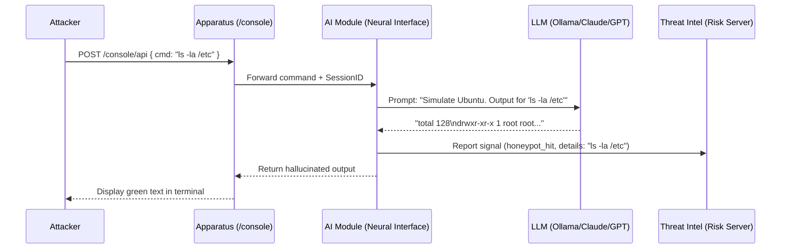
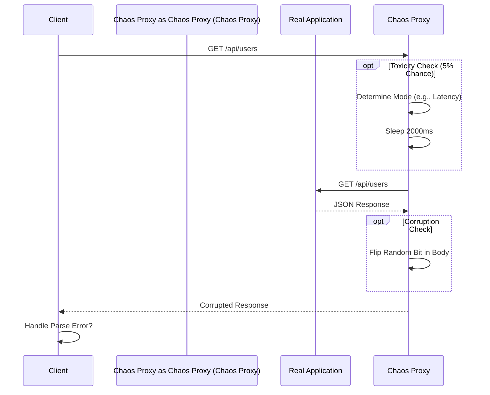
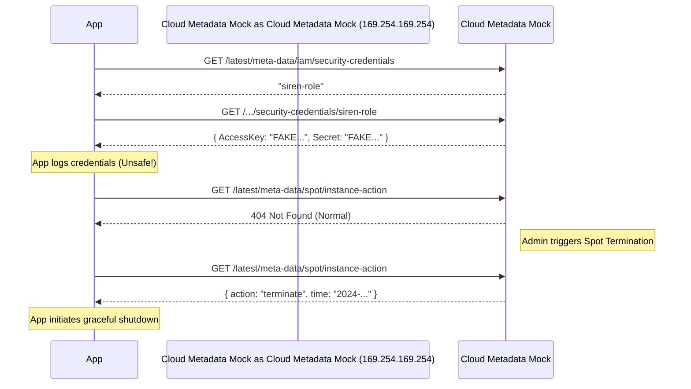
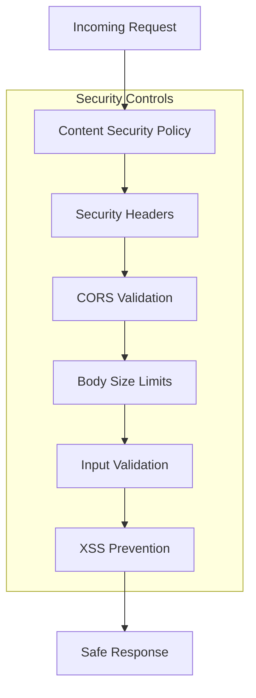
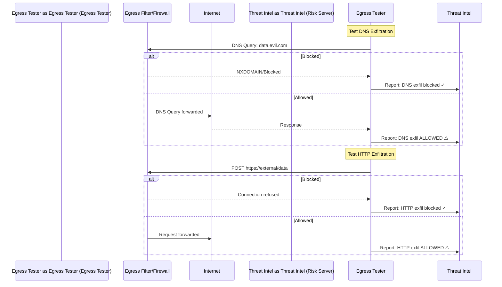

# Apparatus Ecosystem Architecture

This document visualizes the interactions between the core components of the Apparatus (formerly Apparatus) ecosystem, including its companion tools: **Egress Tester** (egress tester), **Cloud Metadata Mock** (cloud metadata mock), and **Chaos Proxy** (chaos proxy).

## 0. Apparatus Core Service Architecture

The main Apparatus service exposes multiple interfaces and includes defensive middleware layers.

```mermaid
graph TB
    subgraph "Apparatus Core Service"
        HTTP[HTTP/1.1 :8080]
        HTTP2[HTTP/2 TLS :8443]
        TCP[TCP Echo :9000]
        UDP[UDP Echo :9001]
        Redis[Redis Mock :6379]

        subgraph "Express Middleware Stack"
            MTD[MTD - Route Polymorphism]
            SelfHeal[Self-Healing QoS]
            Deception[Deception Engine]
            Tarpit[Tarpit Defense]
            Shield[Active Shield WAF]
        end

        subgraph "Endpoints"
            Echo[/echo/* - Request Mirror]
            Health[/healthz - Health Check]
            Dashboard[/dashboard - Command Center]
            Metrics[/metrics - Prometheus]
            Threat Intel[/threat-intel/status - Risk Server]
        end

        Static[Static Files]
    end

    HTTP --> MTD --> SelfHeal --> Deception --> Tarpit --> Shield --> Echo
    HTTP --> Health
    HTTP --> Dashboard --> Static
    HTTP --> Metrics
    HTTP --> Threat Intel

    RiskServer[Threat Intel Risk Server] <-->|Blocklist Sync| Threat Intel
```

### Key Components

| Component | Port | Purpose |
|-----------|------|---------|
| HTTP/1.1 | 8080 | Primary API, Dashboard, Health checks |
| HTTP/2 TLS | 8443 | Secure API with TLS termination |
| TCP Echo | 9000 | Raw TCP protocol testing |
| UDP Echo | 9001 | Raw UDP protocol testing |
| Redis Mock | 6379 | Redis protocol honeypot |

### Middleware Defense Layers

1. **MTD (Moving Target Defense)** - Polymorphic route shuffling
2. **Self-Healing** - Automatic circuit breaking and recovery
3. **Deception Engine** - AI-powered honeypot responses
4. **Tarpit Defense** - Rate limiting and slow-response traps
5. **Active Shield** - WAF-style virtual patching

### Graceful Shutdown

The service handles SIGINT/SIGTERM signals to:
- Close HTTP/HTTPS servers
- Drain active connections
- Stop protocol servers (TCP, UDP, Redis)
- Log shutdown completion

## 1. High-Level Ecosystem

The Apparatus suite is designed to be deployed within a Kubernetes cluster to simulate a complete hostile/testing environment.

```mermaid
graph TD
    User[User / Attacker] -->|Ingress| WAF[WAF / Firewall]
    WAF -->|Allowed| Chaos Proxy[Chaos Proxy - Chaos Proxy]
    Chaos Proxy -->|Proxy| Apparatus[Apparatus - Target]

    subgraph "Internal Network"
        Apparatus
        Chaos Proxy
        Cloud Metadata Mock[Cloud Metadata Mock - Cloud Mock]
        Egress Tester[Egress Tester - Egress Tester]
        Neural[Neural Interface]
    end

    Apparatus -->|Sync Blocklist| Threat Intel[Threat Intel - Risk Server]
    Apparatus -->|Report Honeypot| Threat Intel
    Apparatus -->|Generative Text| Neural

    Neural -->|Local| Ollama[Ollama]
    Neural -->|Cloud| OpenAI[OpenAI / Anthropic]

    Egress Tester -->|Probe Egress| Internet((Internet))
    Egress Tester -->|Report Breach| Threat Intel

    Apparatus -.->|Metadata Request| Cloud Metadata Mock
```

## 2. Interactive Honeypot Workflow (Neural Interface)

This flow traps attackers in an LLM-powered hallucinated environment.




## 3. Chaos Proxy - Chaos Proxy Flow (Resilience Testing)

How Chaos Proxy injects faults into legitimate traffic without code changes.



## 4. Cloud Metadata Mock - Cloud Metadata Deception

Simulating cloud environments (AWS IMDS, GCP) to test application behavior.



## 5. Security Architecture

### Defense-in-Depth Layers



### Security Controls Summary

| Control | Implementation | Purpose |
|---------|---------------|---------|
| CSP | Meta tag + headers | Prevent script injection |
| Body Limits | 20MB default | Prevent DoS via large payloads |
| Buffer Limits | 64KB Redis | Prevent memory exhaustion |
| XSS Prevention | textContent, escapeHtml() | Prevent DOM injection |
| Port Validation | parsePort() helper | Prevent invalid configuration |
| Error Handling | try/catch + Express error handler | Prevent information leakage |
| Async Safety | res.headersSent checks | Prevent double responses |

### OWASP Alignment

- **A03 Injection**: Input validation, parameterized outputs
- **A05 Misconfiguration**: CSP headers, secure defaults
- **A09 Logging**: Structured logging via Pino

## 6. Egress Tester - Egress Testing Flow

Testing egress filter effectiveness with various exfiltration techniques.


