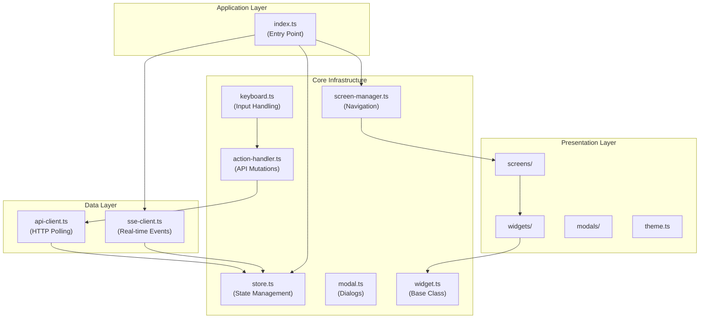
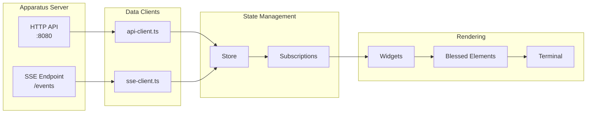
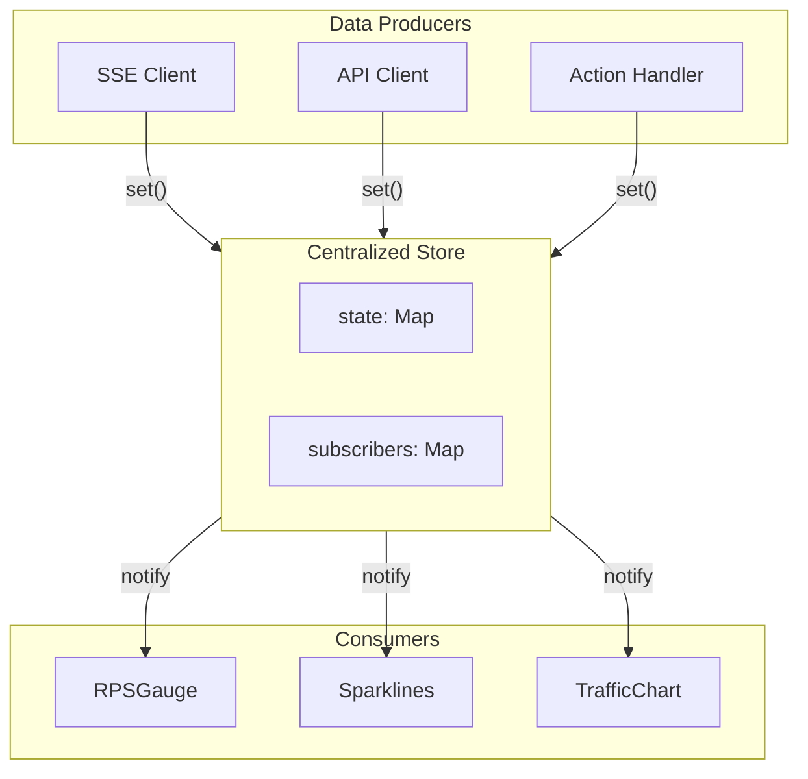
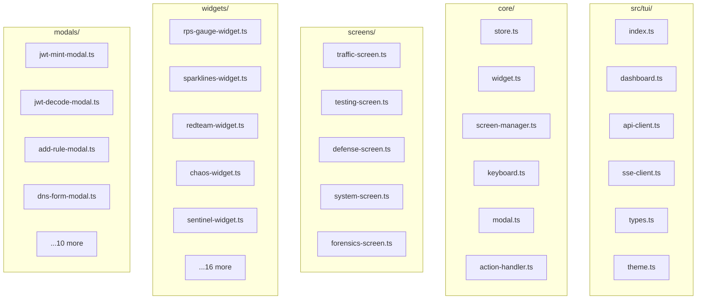
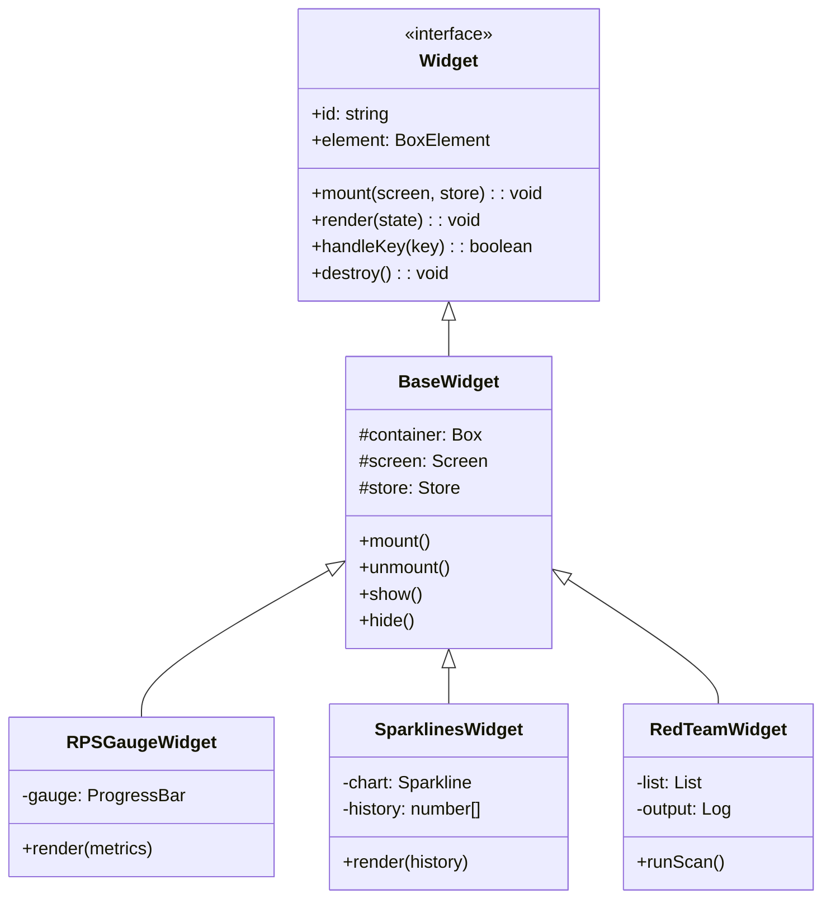
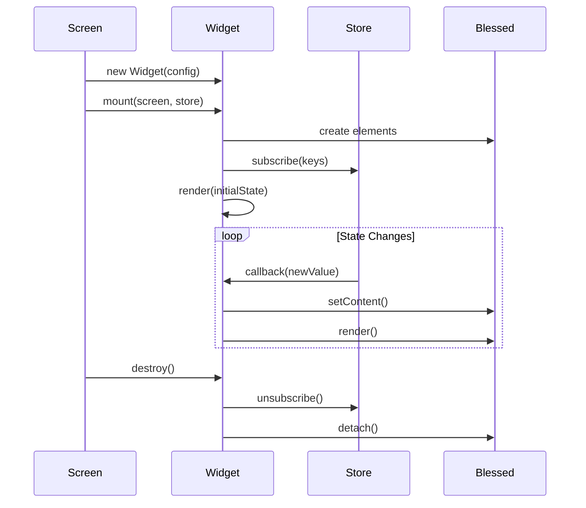
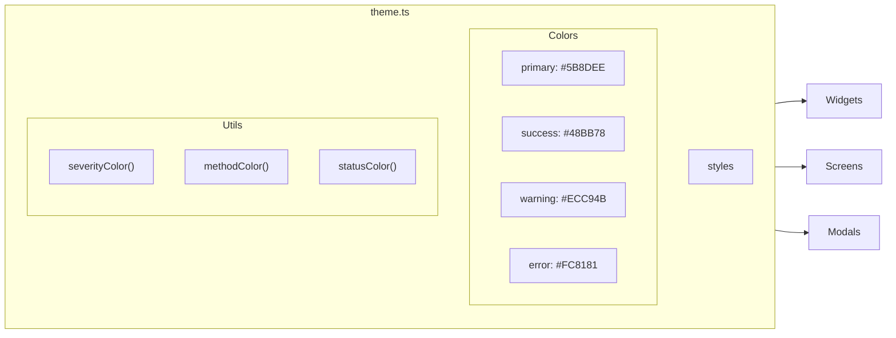

# Apparatus TUI Architecture

Architectural overview of the Apparatus Terminal User Interface with Mermaid diagrams.

---

## Component Hierarchy

### Layer Responsibilities

| Layer | Purpose | Files |
|-------|---------|-------|
| **Application** | Bootstrap, main loop | `index.ts` |
| **Core** | Infrastructure services | `core/*.ts` |
| **Data** | Server communication | `api-client.ts`, `sse-client.ts` |
| **Presentation** | Visual components | `screens/`, `widgets/`, `modals/` |

---

## Data Flow Architecture

### Data Flow Steps

1. **Server Events**: Apparatus emits SSE events for real-time metrics
2. **Client Ingestion**: `sse-client.ts` receives events, `api-client.ts` polls periodically
3. **State Update**: Clients call `store.set(key, value)` to update state
4. **Notification**: Store notifies all subscribers for that key
5. **Widget Update**: Widgets receive new data via callback
6. **Render**: Widgets update blessed elements, triggering screen render

---

## Screen Navigation

```mermaid
stateDiagram-v2
    [*] --> Monitor: Default

    Monitor --> Traffic: 2
    Traffic --> Testing: 3
    Testing --> Defense: 4
    Defense --> System: 5
    System --> Forensics: 6
    Forensics --> Monitor: 1

    state Monitor {
        Health --> Stats
        Stats --> Alerts
        Alerts --> Requests
    }

    state Traffic {
        RPSGauge --> Sparklines
        Sparklines --> Charts
    }

    state Testing {
        RedTeam --> Chaos
        Chaos --> Ghost
        Ghost --> NetDiag
    }

    state Defense {
        Sentinel --> MTD
        MTD --> DLP
    }

    state System {
        Cluster --> SysInfo
        SysInfo --> KVStore
        KVStore --> Webhooks
    }

    state Forensics {
        PCAP --> HAR
        HAR --> JWT
        JWT --> OIDC
    }
```

---

## State Management

### State Keys

| Key | Type | Source | Description |
|-----|------|--------|-------------|
| `metrics` | `MetricsData` | SSE | Real-time RPS, latency |
| `traffic` | `TrafficEvent[]` | SSE | Recent requests |
| `history` | `number[]` | SSE | RPS history for sparklines |
| `alerts` | `Alert[]` | SSE | Security alerts |
| `sysinfo` | `SysInfo` | API | System information |
| `cluster` | `ClusterState` | SSE | Node status |
| `sentinel` | `SentinelState` | API | Active Shield rules |
| `mtd` | `MTDState` | API | MTD state |

---

## File Structure

---

## Widget System

### Widget Categories

| Category | Widgets | Screen |
|----------|---------|--------|
| **Traffic** | RPSGauge, Sparklines, TrafficChart | Traffic (2) |
| **Testing** | RedTeam, Chaos, Ghost, NetDiag | Testing (3) |
| **Defense** | Sentinel, MTD, DLP | Defense (4) |
| **System** | Cluster, SysInfo, KV, Webhook | System (5) |
| **Forensics** | PCAP, HAR, JWT, OIDC | Forensics (6) |

---

## Widget Lifecycle

---

## Theme System

### Color Functions

| Function | Input | Output |
|----------|-------|--------|
| `severityColor(level)` | `critical`, `high`, `medium`, `low` | red, yellow, cyan, green |
| `methodColor(method)` | `GET`, `POST`, `DELETE` | green, blue, red |
| `statusColor(code)` | `2xx`, `4xx`, `5xx` | green, yellow, red |

---

## Summary

The Apparatus TUI architecture emphasizes:

1. **Modularity** - Each widget is self-contained with clear lifecycle
2. **Reactivity** - Subscription-based updates minimize unnecessary renders
3. **Separation of Concerns** - Data, state, and presentation cleanly separated
4. **Extensibility** - New widgets/screens added with minimal changes
5. **Consistency** - Centralized theme ensures visual coherence

---

*Architecture Documentation v1.0 | December 2024*
