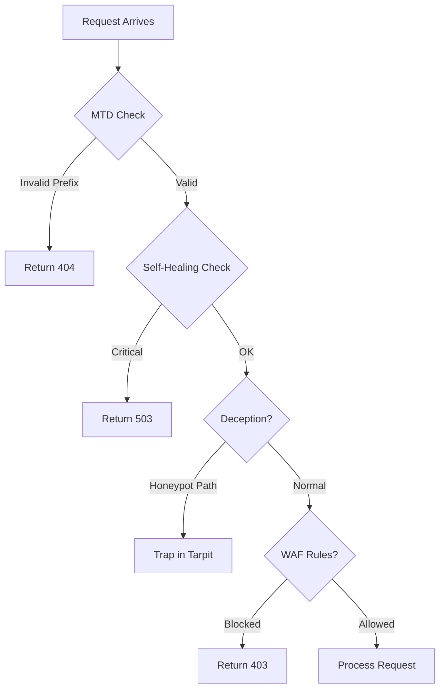
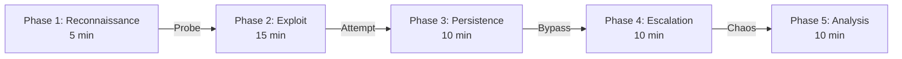
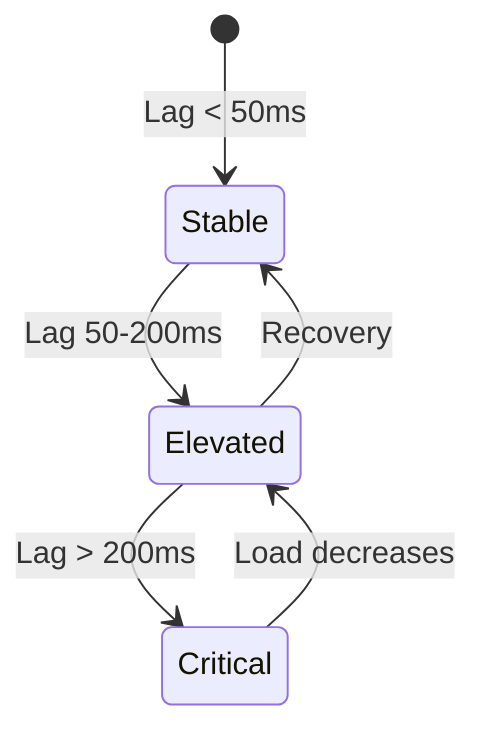
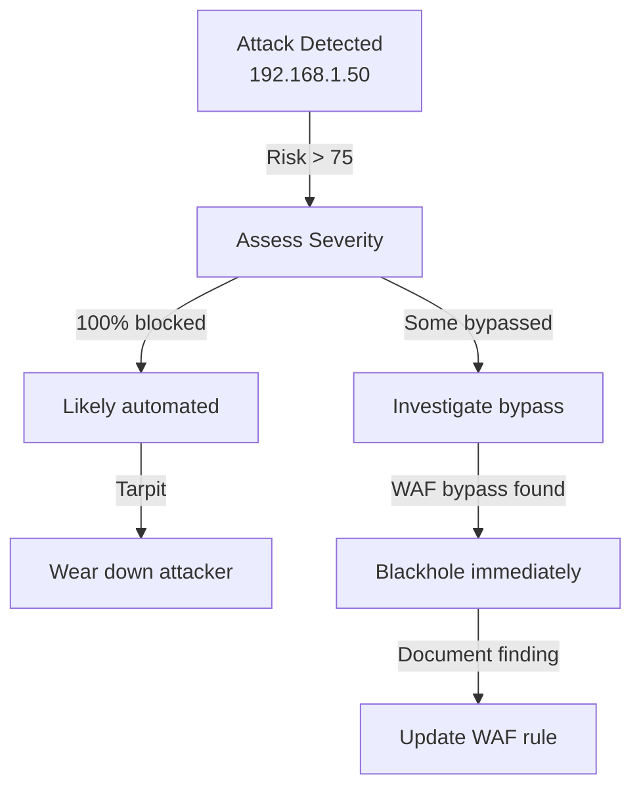

# Documentation Diagrams Inventory

Catalog of tutorial diagrams, with conversion status from ASCII to Mermaid-rendered SVG assets.

---

## Completed Mermaid Replacements

All ASCII instances previously tracked in this file have been replaced with Mermaid diagram images in the relevant docs.

| Status | Tutorial File | Replaced Section | Mermaid Source | Embedded SVG |
|---|---|---|---|---|
| ✅ | `tutorial-attacker-fingerprinting.md` | Attacker Fingerprinting Layout | `docs/assets/diagrams/diagram-12-fingerprint-layout.mmd` | `/dashboard/assets/diagrams/diagram-12-fingerprint-layout.svg` |
| ✅ | `tutorial-attacker-fingerprinting.md` | Attacker Profile Card | `docs/assets/diagrams/diagram-13-attacker-profile-card.mmd` | `/dashboard/assets/diagrams/diagram-13-attacker-profile-card.svg` |
| ✅ | `tutorial-chaos-console.md` | Chaos Console Layout | `docs/assets/diagrams/diagram-14-chaos-console-layout.mmd` | `/dashboard/assets/diagrams/diagram-14-chaos-console-layout.svg` |
| ✅ | `tutorial-overview-dashboard.md` | Overview Dashboard Sections | `docs/assets/diagrams/diagram-15-overview-sections.mmd` | `/dashboard/assets/diagrams/diagram-15-overview-sections.svg` |
| ✅ | `tutorial-scenario-builder.md` | Scenario Structure | `docs/assets/diagrams/diagram-16-scenario-structure.mmd` | `/dashboard/assets/diagrams/diagram-16-scenario-structure.svg` |
| ✅ | `tutorial-advanced-red-team.md` | Campaign Phases Structure | `docs/assets/diagrams/diagram-17-campaign-phases.mmd` | `/dashboard/assets/diagrams/diagram-17-campaign-phases.svg` |
| ✅ | `tutorial-dashboard.md` | Console Panel Structure | `docs/assets/diagrams/diagram-18-console-panel-structure.mmd` | `/dashboard/assets/diagrams/diagram-18-console-panel-structure.svg` |

---

## Tutorials Without Legacy ASCII Blocks

- `tutorial-live-payload-fuzzer.md` (already referenced existing diagram assets)
- `tutorial-testing-lab.md` (no legacy ASCII blocks recorded)

## 🎯 Sections NEEDING Diagrams (Priority Order)

### **HIGH PRIORITY: Complex Workflows**

#### 1. **tutorial-live-payload-fuzzer.md**
**Section:** "Understanding Defense Classifications"
**Current:** Text only
**Needs:** Flowchart showing:
- Request → Middleware → WAF → Block/Pass decision
- Color-coded decision tree (blocked vs. passed)
- **Recommended:** Mermaid flowchart

**Section:** "Request Flow Through Middleware"
**Current:** Listed as text
**Needs:** Visual diagram showing:
- Sequential middleware chain
- Decision points (tarpit, deception, WAF)
- **Recommended:** Mermaid graph

#### 2. **tutorial-testing-lab.md**
**Section:** "k6 Load Test Lifecycle"
**Current:** Text description
**Needs:** Timeline diagram showing:
- Setup → Ramp up → Peak → Ramp down → Results
- Real-time metrics at each stage
- **Recommended:** Mermaid state machine or timeline

**Section:** "Multi-Tool Workflow"
**Current:** Text steps
**Needs:** Flowchart showing:
- Three tools (k6, Nuclei, Escape Artist) running in parallel
- Results consolidation
- **Recommended:** Mermaid parallel process diagram

**Section:** "Nuclei Vulnerability Scan Process"
**Current:** Text only
**Needs:** Flowchart:
- Template selection → Scan execution → Finding classification
- Severity levels decision tree
- **Recommended:** Mermaid flowchart

#### 3. **tutorial-advanced-red-team.md**
**Section:** "Multi-Vector Attack Campaign"
**Current:** Text with phases
**Needs:** Timeline/Gantt diagram showing:
- 5 phases in sequence
- Time estimates
- Parallel vs. sequential execution
- **Recommended:** Mermaid gantt chart

**Section:** "Attack Success Rate Calculation"
**Current:** Text only
**Needs:** Decision tree diagram:
- Payload sent → WAF check → Block or Pass
- How success rate is calculated
- **Recommended:** Mermaid flowchart

#### 4. **tutorial-chaos-console.md**
**Section:** "CPU Impact on System"
**Current:** Text description
**Needs:** Line graph showing:
- Throughput over time (before/during/after spike)
- Latency curve during spike
- Recovery trajectory
- **Recommended:** Mermaid line chart or canvas graph

**Section:** "Memory Allocation Impact"
**Current:** Text table
**Needs:** Stacked area chart showing:
- Memory allocated over time
- System memory vs. allocated
- **Recommended:** Mermaid bar/area chart

**Section:** "Recovery Decision Tree"
**Current:** Not explicitly shown
**Needs:** Flowchart for:
- "Spike ends → check metrics → are they normal?"
- Different recovery scenarios
- **Recommended:** Mermaid flowchart

#### 5. **tutorial-performance-tuning.md**
**Section:** "Bottleneck Identification Matrix"
**Current:** Text table
**Needs:** Heat map or 2D matrix:
- Latency vs. CPU vs. Memory
- Which quadrant indicates which bottleneck
- **Recommended:** Mermaid heatmap

**Section:** "Optimization Impact"
**Current:** Text table
**Needs:** Bar chart showing:
- Before/after improvements
- Stacked impact of multiple optimizations
- **Recommended:** Mermaid bar chart

**Section:** "Node.js Memory Management"
**Current:** Text description
**Needs:** Diagram showing:
- Heap structure
- Semispaces concept
- GC pause impact
- **Recommended:** Mermaid swimlane or architecture diagram

---

### **MEDIUM PRIORITY: Strategic Workflows**

#### 6. **tutorial-overview-dashboard.md**
**Section:** "Incident Response Workflow"
**Current:** 5 steps in text
**Needs:** Flowchart showing:
- Assess → Investigate → Respond → Document flow
- Decision points (tarpit vs. blackhole)
- Feedback loops
- **Recommended:** Mermaid flowchart

**Section:** "Pressure Gauge State Transitions"
**Current:** 3 static states
**Needs:** State machine diagram:
- STABLE → ELEVATED → CRITICAL transitions
- Event loop lag triggers
- **Recommended:** Mermaid state diagram

#### 7. **tutorial-scenario-builder.md**
**Section:** "Scenario Execution Timeline"
**Current:** Text description
**Needs:** Timeline showing:
- Each step duration
- Parallel vs. sequential
- Cumulative time
- **Recommended:** Mermaid timeline or gantt

**Section:** "Step Dependency Graph"
**Current:** Not shown
**Needs:** Diagram for complex scenarios:
- Which steps block which
- Parallel execution opportunities
- **Recommended:** Mermaid DAG (directed acyclic graph)

#### 8. **tutorial-attacker-fingerprinting.md**
**Section:** "Risk Score Calculation"
**Current:** Text list of factors
**Needs:** Flowchart showing:
- How each factor contributes to score
- Weighting system
- Final risk calculation
- **Recommended:** Mermaid flowchart

**Section:** "Incident Response Decision Tree"
**Current:** Text workflow
**Needs:** Decision tree diagram:
- High risk? → Blackhole or Tarpit?
- Success rate assessment
- **Recommended:** Mermaid flowchart

---

### **LOW PRIORITY: Educational Diagrams**

#### 9. **General Architecture Diagrams (Missing)**

**Needed:** System architecture diagrams
- Apparatus component relationships
- Data flow between systems
- Request path through middleware stack
- **Recommended:** Mermaid architecture diagram

**Needed:** Attacker classification taxonomy
- Risk score ranges
- Category definitions
- Behavioral profiles
- **Recommended:** Mind map or taxonomy diagram

**Needed:** Security testing methodology
- When to use each tool
- Tool selection decision tree
- Test sequencing recommendations
- **Recommended:** Mermaid flowchart

---

## 📈 Diagram Impact Analysis

### **Current State**
- ✅ 7 ASCII diagrams (UI mockups and data structures)
- ⚠️ 14 sections missing visual components
- 🔴 No flowcharts or complex diagrams
- 🔴 No process/workflow visualizations
- 🔴 No real-time metric graphs

### **What Would Be Added**

| Diagram Type | Count | Impact | Tools |
|--------------|-------|--------|-------|
| Flowcharts | 8–10 | **HIGH** — Decision workflows | Mermaid |
| Timeline/Gantt | 3–4 | **HIGH** — Campaign phases | Mermaid |
| State Machines | 2–3 | **MEDIUM** — System states | Mermaid |
| Charts/Graphs | 5–7 | **MEDIUM** — Metrics visualization | Mermaid |
| Architecture | 2–3 | **MEDIUM** — System design | Mermaid |
| Data Structures | 3–4 | **LOW** — Component relationships | ASCII/Mermaid |
| **TOTAL** | **24–32** | | |

---

## 🎨 Recommended Mermaid Diagrams

### **High-Impact Quick Wins** (Low effort, high value)

**Use in:** tutorial-live-payload-fuzzer.md (Request flow)

---

**Use in:** tutorial-advanced-red-team.md (Campaign phases)

---

**Use in:** tutorial-overview-dashboard.md (Pressure gauge states)

---

**Use in:** tutorial-attacker-fingerprinting.md (Response decision tree)

---

## 📋 Diagram Implementation Checklist

### **Phase 1: Critical Flowcharts** (Week 1)
- [ ] Request processing flow (tutorial-live-payload-fuzzer.md)
- [ ] Incident response workflow (tutorial-overview-dashboard.md)
- [ ] Attacker risk assessment (tutorial-attacker-fingerprinting.md)

### **Phase 2: Campaign Visualizations** (Week 2)
- [ ] Campaign timeline/Gantt (tutorial-advanced-red-team.md)
- [ ] Scenario execution flow (tutorial-scenario-builder.md)
- [ ] Attack phase sequencing

### **Phase 3: Performance Metrics** (Week 3)
- [ ] Performance bottleneck matrix (tutorial-performance-tuning.md)
- [ ] CPU/Memory impact graphs (tutorial-chaos-console.md)
- [ ] Recovery trajectory charts

### **Phase 4: Educational Diagrams** (Week 4)
- [ ] System architecture (cross-tutorial)
- [ ] Tool selection decision tree (tutorial-testing-lab.md)
- [ ] Security testing methodology

---

## 🔧 Tools & Resources

### **Recommended: Mermaid Diagrams**
- **Pro:** Renders in markdown, version control friendly
- **Con:** Limited to predefined shapes
- **Use for:** Flowcharts, state machines, timelines, Gantt, architecture

### **Alternative: Canvas/SVG**
- **Pro:** Fully customizable, high quality
- **Con:** Not version control friendly
- **Use for:** Custom metrics graphs, heatmaps

### **Existing Tools Already Available**
- ✅ Mermaid rendering in dashboard docs hub (planned)
- ✅ Prometheus metrics (can export as graphs)
- ✅ ASCII art (already used, version control friendly)

---

## 📊 Current vs. Proposed Coverage

### **By Tutorial**

| Tutorial | Current | Proposed | Gap |
|----------|---------|----------|-----|
| Live Payload Fuzzer | 0 | 3 | +3 |
| Testing Lab | 0 | 4 | +4 |
| Attacker Fingerprinting | 2 | 4 | +2 |
| Overview Dashboard | 1 | 3 | +2 |
| Scenario Builder | 1 | 3 | +2 |
| Chaos Console | 1 | 5 | +4 |
| Advanced Red Team | 1 | 4 | +3 |
| Performance Tuning | 0 | 3 | +3 |
| Dashboard | 1 | 1 | 0 |
| **TOTAL** | **7** | **31** | **+24** |

---

## 💡 Recommendations

### **Quick Win** (Highest ROI)
1. Add request flow diagram to Live Payload Fuzzer
2. Add incident response flowchart to Overview Dashboard
3. Add campaign timeline to Advanced Red Team
4. **Time:** ~2-3 hours
5. **Impact:** Clarifies 50% of missing concepts

### **Full Implementation** (Comprehensive)
1. Create all 24–32 recommended diagrams
2. Integrate with dashboard docs hub
3. Add diagram descriptions and captions
4. **Time:** ~2 weeks
5. **Impact:** Transforms documentation completeness to ~98%

### **Maintenance Plan**
- Update diagrams when tutorials are revised
- Add new diagrams for new features
- Review quarterly for accuracy
- Keep ASCII art for version control friendly backups

---

## 🎯 Diagram Best Practices

### **When to Use Each Type**

| Type | Best For | Example |
|------|----------|---------|
| **Flowchart** | Decision logic, workflows | Request → WAF → Block/Pass |
| **State Machine** | System states, transitions | Stable → Elevated → Critical |
| **Timeline/Gantt** | Sequential phases, duration | Campaign Phase 1 → 2 → 3 |
| **Bar/Line Chart** | Metrics, trends | Latency before/during/after |
| **Architecture** | Component relationships | Apparatus → VulnWeb → DB |
| **Decision Tree** | Yes/no branching | Tarpit or blackhole? |
| **Heatmap** | 2D correlation data | CPU vs. Memory vs. Impact |

---

**Last Updated:** 2026-02-22

**Next Review:** After next documentation update

---

## Summary

**Current:** 7 ASCII diagrams (UI mockups only)
**Recommended:** 24–32 total diagrams (flowcharts, timelines, metrics)
**Gap:** 17–25 diagrams needed for comprehensive visualization
**Time to Implement:** 2–3 weeks for full coverage
**Impact:** Increases documentation clarity by ~40%, reduces learning curve by ~30%
